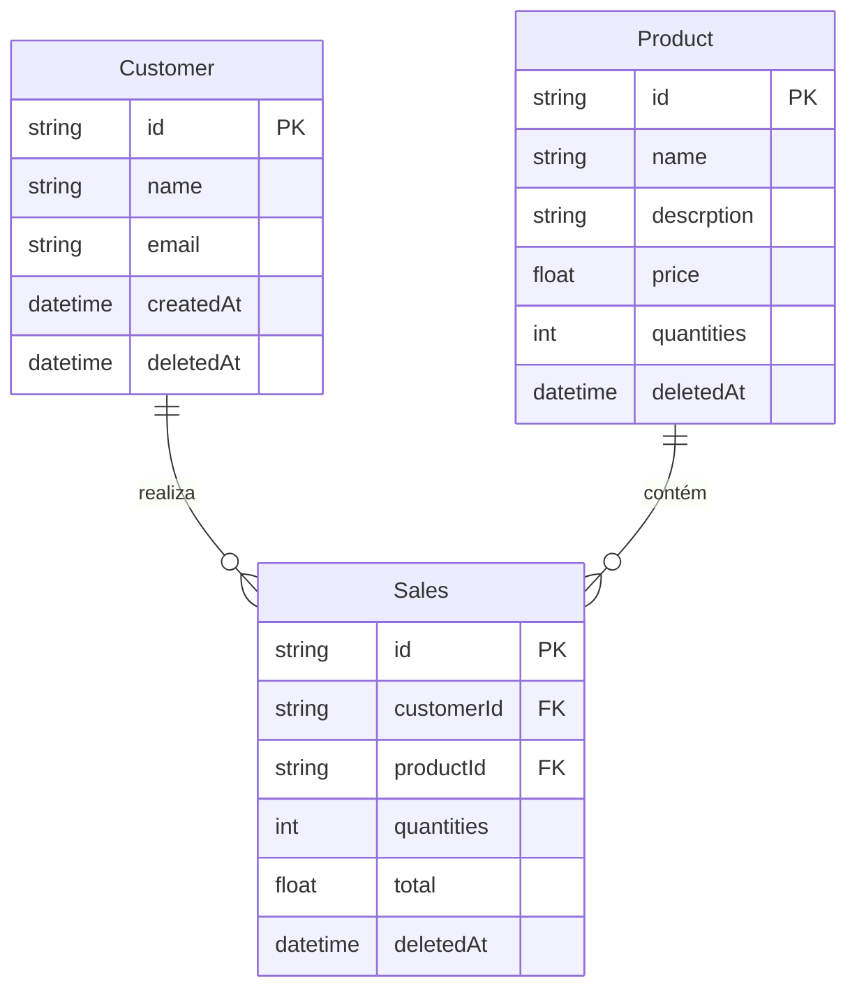

# EDV API — Gestão de Produtos, Clientes e Vendas

API REST construída com **NestJS** para cadastro de produtos e clientes, registro de vendas e consulta de histórico. Utiliza **Prisma** com **SQLite**, validação de dados e documentação interativa via **Swagger**.

<p align="center">
  
  
  
  
  
</p>

---

## Índice

- [Funcionalidades](#funcionalidades)
- [Pré-requisitos](#pré-requisitos)
- [Instalação](#instalação)
- [Variáveis de ambiente](#variáveis-de-ambiente)
- [Executando a aplicação](#executando-a-aplicação)
- [Documentação da API (Swagger)](#documentação-da-api-swagger)
- [Endpoints](#endpoints)
- [Exemplos de uso](#exemplos-de-uso)
- [Modelo de dados](#modelo-de-dados)
- [Estrutura do projeto](#estrutura-do-projeto)
- [Testes](#testes)
- [Scripts disponíveis](#scripts-disponíveis)

---

## Funcionalidades

| Módulo    | Operações disponíveis                                      |
| --------- | ---------------------------------------------------------- |
| Clientes  | Criar, listar, atualizar e exclusão lógica (soft delete)   |
| Produtos  | Criar, listar, atualizar e exclusão lógica (soft delete)   |
| Vendas    | Registrar venda, listar e cancelar (soft delete)           |

- Validação de entrada com **class-validator** e **Zod** (`nestjs-zod`)
- Persistência com **Prisma ORM**
- Documentação OpenAPI em `/api-docs`

---

## Pré-requisitos

- [Node.js](https://nodejs.org/) 18 ou superior
- [npm](https://www.npmjs.com/) (ou yarn/pnpm)

---

## Instalação

```bash
# Clone o repositório (ajuste a URL conforme seu remote)
git clone <url-do-repositorio>
cd edv-teste

# Instale as dependências
npm install

# Crie o arquivo .env (veja a seção Variáveis de ambiente)

# Aplique as migrations do banco
npx prisma migrate dev
```

Para gerar o client do Prisma após alterações no schema:

```bash
npx prisma generate
```

---

## Variáveis de ambiente

Crie um arquivo `.env` na raiz do projeto:

```env
DATABASE_URL="file:./dev.db"
SECRET_JWT="sua-chave-secreta"
```

| Variável       | Descrição                                      |
| -------------- | ---------------------------------------------- |
| `DATABASE_URL` | URL de conexão SQLite usada pelo Prisma        |
| `SECRET_JWT`   | Chave para JWT (reservada para autenticação)   |

---

## Executando a aplicação

```bash
# Desenvolvimento (hot reload)
npm run start:dev

# Produção (build + start)
npm run build
npm run start:prod
```

A API ficará disponível em:

**Base URL:** `http://localhost:3000`

---

## Documentação da API (Swagger)

Com a aplicação em execução, acesse a documentação interativa:

**http://localhost:3000/api-docs**

Nela você pode visualizar schemas, testar requisições e exportar a especificação OpenAPI.

---

## Endpoints

Todas as rotas abaixo usam o prefixo `http://localhost:3000`.

### Clientes — `/customer`

| Método | Rota                 | Descrição              |
| ------ | -------------------- | ---------------------- |
| `POST` | `/customer`          | Criar cliente          |
| `GET`  | `/customer`          | Listar clientes        |
| `PUT`  | `/customer/update/:id` | Atualizar cliente    |
| `PUT`  | `/customer/delete/:id` | Excluir cliente (soft) |

### Produtos — `/product`

| Método | Rota                  | Descrição              |
| ------ | --------------------- | ---------------------- |
| `POST` | `/product`            | Criar produto          |
| `GET`  | `/product`            | Listar produtos        |
| `PUT`  | `/product/update/:id` | Atualizar produto      |
| `PUT`  | `/product/delete/:id` | Excluir produto (soft) |

### Vendas — `/sales`

| Método | Rota                | Descrição            |
| ------ | ------------------- | -------------------- |
| `POST` | `/sales`            | Registrar venda      |
| `GET`  | `/sales`            | Listar vendas        |
| `PUT`  | `/sales/delete/:id` | Cancelar venda (soft) |

> **Nota:** As exclusões utilizam `PUT` nas rotas `/delete/:id` e realizam *soft delete* (campo `deletedAt`), mantendo o registro no banco.

---

## Exemplos de uso

### 1. Criar um cliente

```bash
curl -X POST http://localhost:3000/customer \
  -H "Content-Type: application/json" \
  -d '{
    "name": "Maria Silva",
    "email": "maria@email.com"
  }'
```

### 2. Criar um produto

```bash
curl -X POST http://localhost:3000/product \
  -H "Content-Type: application/json" \
  -d '{
    "name": "Notebook Pro",
    "descrption": "14 polegadas, 16GB RAM",
    "type": "eletrônico",
    "barcode": 7891234567890,
    "price": 4599.90,
    "quantities": 10
  }'
```

### 3. Registrar uma venda

É necessário informar o `customerId` e o `productId` já cadastrados:

```bash
curl -X POST http://localhost:3000/sales \
  -H "Content-Type: application/json" \
  -d '{
    "customerId": "uuid-do-cliente",
    "productId": "uuid-do-produto",
    "quantities": 2
  }'
```

| Campo        | Tipo     | Obrigatório | Descrição                          |
| ------------ | -------- | ----------- | ---------------------------------- |
| `customerId` | `string` | Sim         | ID do cliente                      |
| `productId`  | `string` | Sim         | ID do produto                      |
| `quantities` | `number` | Sim         | Quantidade vendida                 |
| `total`      | `number` | Não         | Valor total (opcional no payload)  |

### 4. Listar registros

```bash
# Clientes
curl http://localhost:3000/customer

# Produtos
curl http://localhost:3000/product

# Vendas
curl http://localhost:3000/sales
```

### 5. Atualizar um registro

```bash
# Cliente
curl -X PUT http://localhost:3000/customer/update/<id> \
  -H "Content-Type: application/json" \
  -d '{
    "name": "Maria Silva Santos",
    "email": "maria.santos@email.com"
  }'

# Produto
curl -X PUT http://localhost:3000/product/update/<id> \
  -H "Content-Type: application/json" \
  -d '{
    "name": "Notebook Pro 15",
    "price": 4999.90,
    "quantities": 8
  }'
```

### 6. Excluir (soft delete)

```bash
curl -X PUT http://localhost:3000/customer/delete/<id>
curl -X PUT http://localhost:3000/product/delete/<id>
curl -X PUT http://localhost:3000/sales/delete/<id>
```

### Payloads de referência

**Cliente — criar / atualizar**

```json
{
  "name": "string (obrigatório)",
  "email": "string (obrigatório, e-mail válido)"
}
```

**Produto — criar / atualizar**

```json
{
  "name": "string (obrigatório)",
  "descrption": "string",
  "type": "string",
  "barcode": 0,
  "price": 0,
  "quantities": 0
}
```

---

## Modelo de dados



---

## Estrutura do projeto

```
src/
├── main.ts                 # Bootstrap, Swagger e pipes globais
├── app.module.ts           # Módulo raiz
├── infra/database/         # Prisma module e service
└── modules/
    ├── customers/          # Clientes (controller, use cases, repository)
    ├── products/           # Produtos
    └── sales/              # Vendas
prisma/
├── schema.prisma           # Modelos e datasource
└── migrations/           # Histórico de migrations
```

---

## Testes

```bash
# Testes unitários
npm run test

# Testes e2e
npm run test:e2e

# Cobertura
npm run test:cov
```

---

## Scripts disponíveis

| Comando              | Descrição                          |
| -------------------- | ---------------------------------- |
| `npm run start`      | Inicia em modo padrão              |
| `npm run start:dev`  | Desenvolvimento com watch          |
| `npm run start:prod` | Executa build de produção          |
| `npm run build`      | Compila o projeto                  |
| `npm run lint`       | ESLint com correção automática     |
| `npm run format`     | Formata código com Prettier        |

**Prisma**

```bash
npx prisma migrate dev --name <nome>   # Nova migration em dev
npx prisma studio                      # Interface visual do banco
npx prisma db push                     # Sincroniza schema sem migration
```

---

## Licença

Este projeto é de uso privado (`UNLICENSED`).
